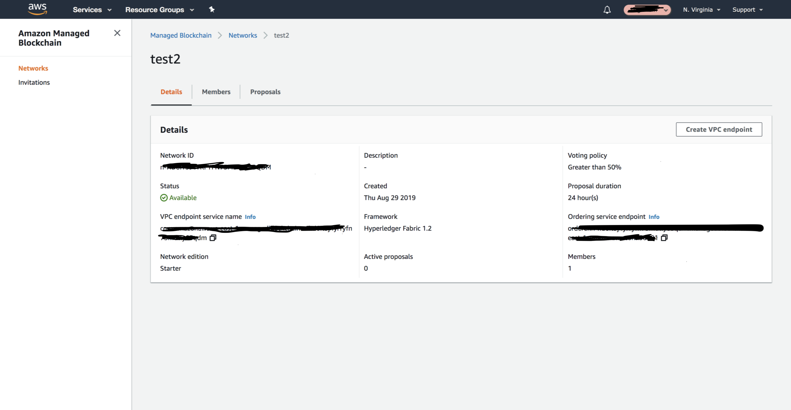

# AWS_Managed_Bockchain_Setup


This a detailed description of setting up the AWS Managed Blockchain Service and  Blockchain Client Node.

There are two components here we will work on:
1. AWS Managed Blockchain Service.
2. Blockchain Client Node.


## 1. Setting up AWS Managed Blockchain Service

The AWS Blockchain service looks like the picture given below. It will give us the endpoints which we will use in the 
Blockchain Client Node.





## 2. Setting up the Client Node  ( for e.g. BMW AG)


I have used the Cloud9 terminal by AWS throughout the setup because my EC2 instance is in public VPC working in the private VPC and there was no easy way to connect to the ec2 instance in the  private VPC.

Step 1: (Cloud9 instance setup, not mandatory.I will just use its terminal.)

1. Start the AWS Cloud9 instance.
2. Clone the repo :

```
cd ~
git clone https://github.com/aws-samples/AWS_Managed_Bockchain_Setup.git


```

Update the AWS CLI 

```
sudo pip install awscli --upgrade
```


## Create Fabric Client Node 

The fabric client node will host the Fabric CLI.The  fabric client will be created in its own VPC in your AWS account.
I have attached the Cloud Formation Template which will create the Fabric Clien node, the vpc and endpoints.

The cloud formation template requires a number of parameter values.We have export these variables before running the script.

In Cloud9:

```
export REGION=<us-east-1> 
export NETWORKID=<the network ID you created , from the Amazon Managed Blockchain Console>
export NETWORKNAME=<the name you gave the network>
```

Now check the VPC endpoint and print it out.

```
export VPCENDPOINTSERVICENAME=$(aws managedblockchain get-network --region $REGION --network-id $NETWORKID --query 'Network.VpcEndpointServiceName' --output text)
echo $VPCENDPOINTSERVICENAME
```

If the VPC endpoint is there with a value then run the given script.It will create  Cloud Formation Stack.
You will see an error saying `key pair does not exist`. This is expected as the script
will check whether the keypair exists before creating it.
Developers from AWS has written the script in such a fashion that It won't overwrite any existing keypairs.


```
cd ~/non-profit-blockchain/ngo-fabric
./3-vpc-client-node.sh
```


## Step 3  Enroll the identity in the Fabric client Node


SSH into your client node created from the Cloud Formation Stack.

```
cd ~
ssh ec2-user@<dns of EC2 instance> -i ~/< name>-keypair.pem
```

Before enrolling the identity ,we need to do the following things:
* Export the ENV variables that provides a context to Hyperledger Fabric.


Create the file that includes the ENV export values that define your Fabric network configuration.

```
cd ~/non-profit-blockchain/ngo-fabric
cp templates/exports-template.sh fabric-exports.sh
vi fabric-exports.sh
```

Now update the export statements and then source the file again.

````cd ~/non-profit-blockchain/ngo-fabric
source fabric-exports.sh

````

Sourcing the file will do two things:

* export the necessary ENV variables
* create another file which contains the export values you need to use when working with a Fabric peer node. This can be    found in the file: `~/peer-exports.sh.` You will see how to use this in a later step.


Check the source worked by typing the given command:

```
$ echo $PEERSERVICEENDPOINT
nd-4MHB4EKFCRF7VBHXZE2ZU4F6GY.m-B7YYBFY4GREBZLPCO2SUS4GP3I.n-WDG36TTUD5HEJORZUPF4REKMBI.managedblockchain.us-east-1.amazonaws.com:30003

```
Now we need the latest version of PEM file.  It will overwrite the exisiting file in the home directory.

```
aws s3 cp s3://us-east-1.managedblockchain/etc/managedblockchain-tls-chain.pem  /home/ec2-user/managedblockchain-tls-chain.pem
```

Finally, we are  going to enrolling an ADMIN Identity with the Fabric CA. We will utilize this identity to administer the whole network.

```
export PATH=$PATH:/home/ec2-user/go/src/github.com/hyperledger/fabric-ca/bin
cd ~
fabric-ca-client enroll -u https://$ADMINUSER:$ADMINPWD@$CASERVICEENDPOINT --tls.certfiles /home/ec2-user/managedblockchain-tls-chain.pem -M /home/ec2-user/admin-msp 


```

Copying the certificates into a new directory:

```
mkdir -p /home/ec2-user/admin-msp/admincerts
cp ~/admin-msp/signcerts/* ~/admin-msp/admincerts/
cd ~/non-profit-blockchain/ngo-fabric

```
  One more thing, if you are restarting the ec2 instance you have to source the file again as follows:

```
  cd ~/non-profit-blockchain/ngo-fabric
source fabric-exports.sh
```


# Step 4  Update the configtx channel configuration :

The  configtx contains the channel configuration.

Update the configtx channel configuration. You have to update the member ID in the file which looks like the file given below.

All the IDs like member ID you will get from AWS Managed Blockchain Service ( Step 1 explained).

````
################################################################################
#
#   Section: Organizations
#
#   - This section defines the different organizational identities which will
#   be referenced later in the configuration.
#
################################################################################
Organizations:
    - &Org1
            # DefaultOrg defines the organization which is used in the sampleconfig
            # of the fabric.git development environment
        Name: MemberID
            # ID to load the MSP definition as
        ID: MemberID
        MSPDir: /opt/home/admin-msp
            # AnchorPeers defines the location of peers which can be used
            # for cross org gossip communication.  Note, this value is only
            # encoded in the genesis block in the Application section context    
        AnchorPeers:    
            - Host: 
              Port:    

################################################################################
#
#   SECTION: Application
#
#   - This section defines the values to encode into a config transaction or
#   genesis block for application related parameters
#
################################################################################
Application: &ApplicationDefaults
        # Organizations is the list of orgs which are defined as participants on
        # the application side of the network
    Organizations:

################################################################################
#
#   Profile
#
#   - Different configuration profiles may be encoded here to be specified
#   as parameters to the configtxgen tool
#
################################################################################
Profiles:
    OneOrgChannel:
        Consortium: AWSSystemConsortium
        Application:
            <<: *ApplicationDefaults
            Organizations:
                - *Org1


````


# Step 5 Create a Fabric Channel 

We have to create a Fabric Channel.

Execute the script:

```
docker exec -e "CORE_PEER_TLS_ENABLED=true" -e "CORE_PEER_TLS_ROOTCERT_FILE=/opt/home/managedblockchain-tls-chain.pem" \
    -e "CORE_PEER_ADDRESS=$PEER" -e "CORE_PEER_LOCALMSPID=$MSP" -e "CORE_PEER_MSPCONFIGPATH=$MSP_PATH" \
    cli peer channel create -c $CHANNEL -f /opt/home/$CHANNEL.pb -o $ORDERER --cafile $CAFILE --tls --timeout 900s
    
    
    
```


The output should look like this:

````
2018-11-26 21:41:29.684 UTC [channelCmd] InitCmdFactory -> INFO 001 Endorser and orderer connections initialized
2018-11-26 21:41:29.752 UTC [cli/common] readBlock -> INFO 002 Got status: &{NOT_FOUND}
2018-11-26 21:41:29.761 UTC [channelCmd] InitCmdFactory -> INFO 003 Endorser and orderer connections initialized
2018-11-26 21:41:29.963 UTC [cli/common] readBlock -> INFO 004 Got status: &{NOT_FOUND}
2018-11-26 21:41:29.972 UTC [channelCmd] InitCmdFactory -> INFO 005 Endorser and orderer connections initialized
2018-11-26 21:41:30.174 UTC [cli/common] readBlock -> INFO 006 Got status: &{NOT_FOUND}
2018-11-26 21:41:34.370 UTC [cli/common] readBlock -> INFO 026 Received block: 0


````

It will create a file  `mychannel.block` in the CLI container in the directory 
`/opt/home/fabric-samples/chaincode/hyperledger/fabric/peer`

You can see the block file here:

```ls -lt /home/ec2-user/fabric-samples/chaincode/hyperledger/fabric/peer```


If the channel creation times out, it's possible that the channel has still been created and you can get the block from the channel itself. Executing the command below will read the channel config and save the genesis block in the same directory as mentioned above:

```docker exec -e "CORE_PEER_TLS_ENABLED=true" -e "CORE_PEER_TLS_ROOTCERT_FILE=/opt/home/managedblockchain-tls-chain.pem"  \
    -e "CORE_PEER_ADDRESS=$PEER"  -e "CORE_PEER_LOCALMSPID=$MSP" -e "CORE_PEER_MSPCONFIGPATH=$MSP_PATH" \
    cli peer channel fetch oldest /opt/home/fabric-samples/chaincode/hyperledger/fabric/peer/$CHANNEL.block \
    -c $CHANNEL -o $ORDERER --cafile /opt/home/managedblockchain-tls-chain.pem --tls   

```


Check that the block file now exists:

```ls -lt /home/ec2-user/fabric-samples/chaincode/hyperledger/fabric/peer ```


## Step5 Join your peer node the channel 


Join peer to Fabric channel.

Execute the following script:

```
docker exec -e "CORE_PEER_TLS_ENABLED=true" -e "CORE_PEER_TLS_ROOTCERT_FILE=/opt/home/managedblockchain-tls-chain.pem" \
    -e "CORE_PEER_ADDRESS=$PEER" -e "CORE_PEER_LOCALMSPID=$MSP" -e "CORE_PEER_MSPCONFIGPATH=$MSP_PATH" \
    cli peer channel join -b $CHANNEL.block  -o $ORDERER --cafile $CAFILE --tls
```

You should see:

```
2018-11-26 21:41:40.983 UTC [channelCmd] InitCmdFactory -> INFO 001 Endorser and orderer connections initialized
2018-11-26 21:41:41.022 UTC [channelCmd] executeJoin -> INFO 002 Successfully submitted proposal to join channel
```


## Step 8 - Install chaincode on your peer node
On the Fabric client node.

Install chaincode on Fabric peer.

Execute the following script:

```
docker exec -e "CORE_PEER_TLS_ENABLED=true" -e "CORE_PEER_TLS_ROOTCERT_FILE=/opt/home/managedblockchain-tls-chain.pem" \
    -e "CORE_PEER_ADDRESS=$PEER" -e "CORE_PEER_LOCALMSPID=$MSP" -e "CORE_PEER_MSPCONFIGPATH=$MSP_PATH" \
    cli peer chaincode install -n $CHAINCODENAME -v $CHAINCODEVERSION -p $CHAINCODEDIR
```

You should see:

```
2018-11-26 21:41:46.585 UTC [chaincodeCmd] checkChaincodeCmdParams -> INFO 001 Using default escc
2018-11-26 21:41:46.585 UTC [chaincodeCmd] checkChaincodeCmdParams -> INFO 002 Using default vscc
2018-11-26 21:41:48.004 UTC [chaincodeCmd] install -> INFO 003 Installed remotely response:<status:200 payload:"OK" > 
```

## Step 9 - Instantiate the chaincode on the channel
On the Fabric client node.

Instantiate chaincode on Fabric channel. This statement may take around 30 seconds, and you
won't see a specific success response.

Execute the following script:

```
docker exec -e "CORE_PEER_TLS_ENABLED=true" -e "CORE_PEER_TLS_ROOTCERT_FILE=/opt/home/managedblockchain-tls-chain.pem" \
    -e "CORE_PEER_ADDRESS=$PEER" -e "CORE_PEER_LOCALMSPID=$MSP" -e "CORE_PEER_MSPCONFIGPATH=$MSP_PATH" \
    cli peer chaincode instantiate -o $ORDERER -C $CHANNEL -n $CHAINCODENAME -v $CHAINCODEVERSION \
    -c '{"Args":["init","a","100","b","200"]}' --cafile $CAFILE --tls
```

You should see:

```
2018-11-26 21:41:53.738 UTC [chaincodeCmd] checkChaincodeCmdParams -> INFO 001 Using default escc
2018-11-26 21:41:53.738 UTC [chaincodeCmd] checkChaincodeCmdParams -> INFO 002 Using default vscc
```

## Step 10 - Query the chaincode
On the Fabric client node.

Query the chaincode on Fabric peer.

Execute the following script:

```
docker exec -e "CORE_PEER_TLS_ENABLED=true" -e "CORE_PEER_TLS_ROOTCERT_FILE=/opt/home/managedblockchain-tls-chain.pem" \
    -e "CORE_PEER_ADDRESS=$PEER" -e "CORE_PEER_LOCALMSPID=$MSP" -e "CORE_PEER_MSPCONFIGPATH=$MSP_PATH" \
    cli peer chaincode query -C $CHANNEL -n $CHAINCODENAME -c '{"Args":["query","a"]}' 
```

You should see:

```
100
```

## Step 11 - Invoke a transaction
On the Fabric client node.

Invoke a Fabric transaction.

Execute the following script:

```
docker exec -e "CORE_PEER_TLS_ENABLED=true" -e "CORE_PEER_TLS_ROOTCERT_FILE=/opt/home/managedblockchain-tls-chain.pem" \
    -e "CORE_PEER_ADDRESS=$PEER" -e "CORE_PEER_LOCALMSPID=$MSP" -e "CORE_PEER_MSPCONFIGPATH=$MSP_PATH" \
    cli peer chaincode invoke -o $ORDERER -C $CHANNEL -n $CHAINCODENAME \
    -c '{"Args":["invoke","a","b","10"]}' --cafile $CAFILE --tls
```

You should see:

```
2018-11-26 21:45:20.935 UTC [chaincodeCmd] chaincodeInvokeOrQuery -> INFO 001 Chaincode invoke successful. result: status:200 
```


## Step 12 - Query the chaincode again and check the change in value
On the Fabric client node.

Query the chaincode on the Fabric peer and check the change in value. This proves the success of the invoke
transaction. If you execute the query immediately after the invoke, you may notice that the data hasn't changed.
Any idea why? There should be a gap of (roughly) 2 seconds between the invoke and query.

Invoking a transaction in Fabric involves a number of steps, including:

* Sending the transaction to the endorsing peers for simulation and endorsement
* Packaging the endorsements from the peers
* Sending the packaged endorsements to the ordering service for ordering
* The ordering service grouping the transactions into blocks (which are created every 2 seconds, by default)
* The ordering service sending the blocks to all peer nodes for validating and committing to the ledger

Only after the transactions in the block have been committed to the ledger can you read the
new value from the ledger (or more specifically, from the world state key-value store).

Execute the following script:

```
docker exec -e "CORE_PEER_TLS_ENABLED=true" -e "CORE_PEER_TLS_ROOTCERT_FILE=/opt/home/managedblockchain-tls-chain.pem" \
    -e "CORE_PEER_ADDRESS=$PEER" -e "CORE_PEER_LOCALMSPID=$MSP" -e "CORE_PEER_MSPCONFIGPATH=$MSP_PATH" \
    cli peer chaincode query -C $CHANNEL -n $CHAINCODENAME -c '{"Args":["query","a"]}' 
```

You should see:

```
90
```


## Copying the chaicode in the CLI container

The Fabric CLI container that is running on your Fabric client node (do docker ps to see it) mounts a folder from the Fabric client node EC2 instance: ```/home/ec2-user/fabric-samples/chaincode.``` .
You can see this by looking at the docker config. Look at the Mounts section in the output where you'll see
```/home/ec2-user/fabric-samples/chaincode``` mounted into the Docker container:

```docker inspect cli ```

You should already have this folder on your Fabric client node as it was created earlier. 
Copying the chaincode into this folder will make it accessible inside the Fabric CLI container.

```
cd ~
/fabric-samples/chaincode/our_project
```


## Installing the chaincode on the peer

Now we are ready to install our project's chaincode on the peers.
-l stands for the language we use Nodejs or Go.


```

docker exec -e "CORE_PEER_TLS_ENABLED=true" -e "CORE_PEER_TLS_ROOTCERT_FILE=/opt/home/managedblockchain-tls-chain.pem" \
    -e "CORE_PEER_LOCALMSPID=$MSP" -e "CORE_PEER_MSPCONFIGPATH=$MSP_PATH" -e "CORE_PEER_ADDRESS=$PEER"  \
    cli peer chaincode install -n our_project -l node -v v0 -p /opt/gopath/src/github.com/our_project

```

Output expected:

```
2018-11-15 06:39:47.625 UTC [chaincodeCmd] checkChaincodeCmdParams -> INFO 001 Using default escc
2018-11-15 06:39:47.625 UTC [chaincodeCmd] checkChaincodeCmdParams -> INFO 002 Using default vscc
2018-11-15 06:39:47.625 UTC [container] WriteFolderToTarPackage -> INFO 003 rootDirectory = /opt/gopath/src/github.com/ngo
2018-11-15 06:39:47.636 UTC [chaincodeCmd] install -> INFO 004 Installed remotely response:<status:200 
```


## Step 3 - Instantiate the chaincode on the channel

Instantiation initializes the chaincode on the channel, i.e. it binds the chaincode to a specific channel.
Instantiation is treated as a Fabric transaction. In fact, when chaincode is instantiated, the Init function
on the chaincode is called. Instantiation also sets the endorsement policy for this version of the chaincode
on this channel. In the example below we are not explictly passing an endorsement policy, so the default
policy of 'any member of the organizations in the channel' is applied.

It can take up to 30 seconds to instantiate chaincode on the channel.

```
docker exec -e "CORE_PEER_TLS_ENABLED=true" -e "CORE_PEER_TLS_ROOTCERT_FILE=/opt/home/managedblockchain-tls-chain.pem" \
    -e "CORE_PEER_LOCALMSPID=$MSP" -e "CORE_PEER_MSPCONFIGPATH=$MSP_PATH" -e "CORE_PEER_ADDRESS=$PEER"  \
    cli peer chaincode instantiate -o $ORDERER -C mychannel -n our_project -v v0 -c '{"Args":["init"]}' --cafile /opt/home/managedblockchain-tls-chain.pem --tls
```

Expected response:
(Note this might fail if the chaincode has been previously instantiated. Chaincode only needs to be
instantiated once on a channel)

```
2018-11-15 06:41:02.847 UTC [chaincodeCmd] checkChaincodeCmdParams -> INFO 001 Using default escc
2018-11-15 06:41:02.847 UTC [chaincodeCmd] checkChaincodeCmdParams -> INFO 002 Using default vscc


```


## Step 5 - Invoke a transaction

Let's add some data to Fabric. Execute the transaction below:

I have assumed that there is a ```create_data``` function in your chaincode.

```
docker exec -e "CORE_PEER_TLS_ENABLED=true" -e "CORE_PEER_TLS_ROOTCERT_FILE=/opt/home/managedblockchain-tls-chain.pem" \
    -e "CORE_PEER_ADDRESS=$PEER" -e "CORE_PEER_LOCALMSPID=$MSP" -e "CORE_PEER_MSPCONFIGPATH=$MSP_PATH" \
    cli peer chaincode invoke -C mychannel -n our_project \
    -c  '{"Args":["create_data","1","2","3"]}' -o $ORDERER --cafile /opt/home/managedblockchain-tls-chain.pem --tls

```


## Step 4 - Query the chaincode

I have assumed that a ```queryAll```function in your chaincode.

```
docker exec -e "CORE_PEER_TLS_ENABLED=true" -e "CORE_PEER_TLS_ROOTCERT_FILE=/opt/home/managedblockchain-tls-chain.pem" \
    -e "CORE_PEER_ADDRESS=$PEER" -e "CORE_PEER_LOCALMSPID=$MSP" -e "CORE_PEER_MSPCONFIGPATH=$MSP_PATH" \
    cli peer chaincode query -C mychannel -n our_project -c '{"Args":["queryAll"]}'
```

Expected response:

```
['1','2','3']
```


After the completion of these steps, 

* Setup the REST API Server 
* Connecting the UI 
* Adding the new members in the Blockchain network


